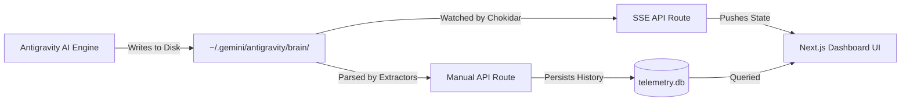

# Antigravity Telemetry Dashboard: Architecture Overview

## Overview
The Telemetry Dashboard is a real-time visualization layer for the Antigravity AI Engine. It bypasses the need for the LLM to manually log its status by directly observing the underlying file system, SQLite databases, and protocol buffers. It serves these raw metrics via an edge-ready Next.js application, completely detached from the core AI loop.

## Architecture
- **Backend Frame:** Next.js (App Router)
- **Data Delivery:** Server-Sent Events (SSE) via `/api/telemetry/stream`
- **Frontend Frame:** React 19 Client Components styled with Tailwind CSS
- **Deployment:** PM2 Daemon running a standalone `server.js` Node process on Windows.

## Key Components

### The SSE Stream (`src/app/api/telemetry/stream/route.ts`)
The core real-time engine. It uses `chokidar` to actively watch the `~/.gemini/antigravity/brain/` directory for filesystem changes. Upon any write event (e.g., changes to `task.md`, `.resolved` steps, or the `telemetry.db`), it pushes an immediate JSON payload to the listening dashboard.

### The Polling Fallback (`src/app/api/telemetry/route.ts`)
A secondary `/api/telemetry` endpoint that performs a hard-read of the entire system state. The frontend uses a robust 5-second `setInterval` to manually hit this endpoint if the SSE stream disconnects, ensuring the dashboard never goes stale due to browser throttling.

### The Internal SQLite DB (`telemetry.db`)
To track historical velocity, the manual polling loop continuously inserts timeline snapshots into an internal SQLite database (`src/lib/db.ts`). This allows the frontend to retrieve a visual sparkline of past AI operations.

## Data Flow

